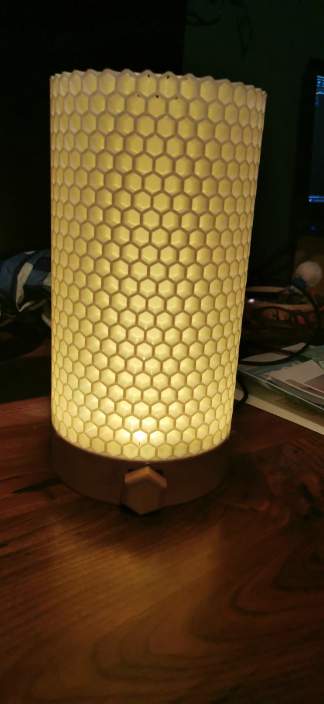
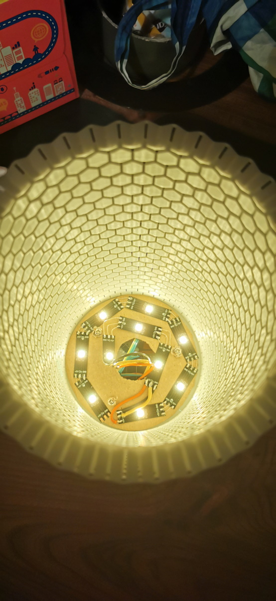

# Honey Bee Lamp

This is a desk lamp using a honeycomb design.
Light is controled by an ESP32 wifi controler and WS2812B led strip.

 

Control is done using WIFI Network API or using physical single rotary button:
- single click turn on/off
- long click select mode (color or intensity)
  - rotary control color/intensity
- very long click switch the lamp to WIFI AccessPoint (and allow to configure the wifi connection)

## 3D model
Honeycomb model comes from: [thingiverse](https://www.thingiverse.com/thing:4807723/files)

Base model is done by myself, and available in this repository

Software is done by myself, and available in this [github repository](https://github.com/chossette/desk_light)

## 3D Print
Print is done using wood PLA for base, and white PLA for honeycomb using a Creality CR-6 SE with [commumnity firwmare](https://github.com/CR6Community)

## Components
- [ESP32-WROOM-32D](https://fr.aliexpress.com/item/32959541446.html?gatewayAdapt=glo2fra&spm=a2g0o.order_list.0.0.21ef5e5bJ1RPx7)
- [10 WS2812B leds](https://www.aliexpress.com/item/4000744445376.html?spm=a2g0o.order_list.0.0.21ef5e5bJ1RPx7)
- [rotary encoder](https://fr.aliexpress.com/item/32816016154.html?gatewayAdapt=glo2fra&spm=a2g0o.order_list.0.0.21ef5e5bJ1RPx7)
- [3.3<->5V level switcher](https://www.aliexpress.com/item/32883006513.html?spm=a2g0o.order_list.0.0.21ef5e5bJ1RPx7)
- [micro usb connector](https://fr.aliexpress.com/item/4000785370254.htmldt)
