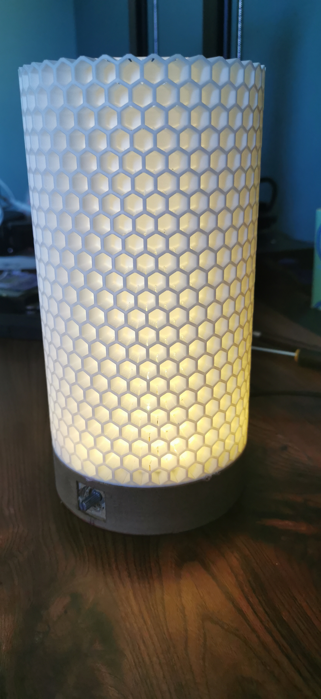

# Honey Bee Lamp

This is a desk lamp using a honeycomb design.
Light is controled by an ESP32 wifi controler and WS2812B led strip.

 

Control is done using WIFI Network API or using physical single rotary button:
- single click turn on/off
- long click select mode (color or intensity)
  - rotary control color/intensity
- very long click switch the lamp to WIFI AccessPoint (and allow to configure the wifi connection)

## 3D model
Honeycomb model comes from: [thingiverse](https://www.thingiverse.com/thing:4807723/files)
Base model is done by myself, and contains in this repository
Software is done by myself, and available in this [github repository](https://github.com/chossette/desk_light)

## 3D Print
Print is done using wood PLA for base, and white PLA for honeycomb using a Creality CR-6 SE with [commumnity firwmare](https://github.com/CR6Community)
